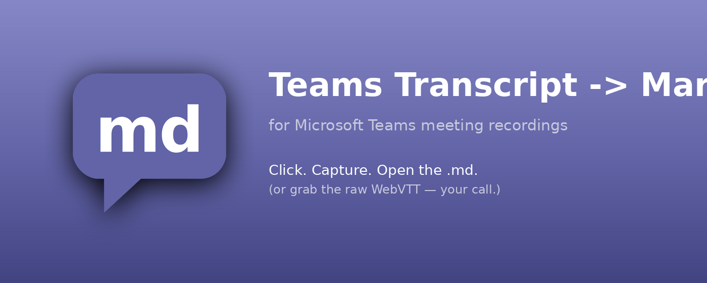
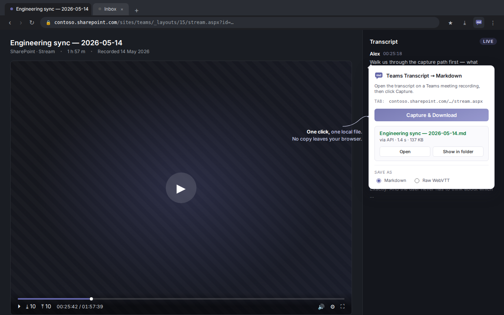

# Teams Transcript → Markdown

<p align="center">
  
</p>

<p align="center">
  <a href="https://chromewebstore.google.com/detail/teams-transcript-to-markd/mkkfjnjhhfnhbfcmaljelamolajalaci">
    
  </a>
  <a href="https://github.com/bkrabach/teams-transcript-md/releases/latest">
    
  </a>
  
  
</p>

A small browser extension (Manifest V3, Chromium-compatible) that
captures the transcript from a Microsoft Teams meeting **recording** and
downloads it as an LLM-friendly Markdown file. Also speaks raw WebVTT
for fast-path captures on SharePoint Stream pages.

|   |   |
| - | - |
| **Chrome Web Store** | <https://chromewebstore.google.com/detail/teams-transcript-to-markd/mkkfjnjhhfnhbfcmaljelamolajalaci> |
| **Project site** | <https://bkrabach.github.io/teams-transcript-md/> |
| **Latest release** (sideload `.zip`) | <https://github.com/bkrabach/teams-transcript-md/releases/latest> |
| **Privacy policy** | <https://bkrabach.github.io/teams-transcript-md/privacy/> |

> Works in Chrome out of the box. Also installs in Edge — toggle
> **Allow extensions from other stores** under
> `edge://extensions/` → Extensions first. Brave, Opera, and other
> Chromium browsers install from the Chrome Web Store directly.

## What it does

<p align="center">
  
</p>

Click the toolbar icon on a Teams page → the popup opens → click
**Capture & Download**. On success a result panel appears in the popup
with the filename and two buttons — **Open** (launches the file in its
default app) and **Show in folder** (reveals it in the OS file
manager). On failure the popup stays open with the error message.

Your last-used options persist across popup opens via
`chrome.storage.local`.

**Two capture paths, picked automatically per page:**

1. **API fast path (`~1–3 s`)** — on SharePoint- or OneDrive-hosted
   recording pages (`*.sharepoint.com/.../stream.aspx*`), the script
   harvests the SharePoint drive/item IDs from the page's bootstrap
   `<script>` tags, calls
   `/_api/v2.1/drives/{driveId}/items/{itemId}?...=media/transcripts`,
   rewrites the returned `temporaryDownloadUrl` to the
   `streamContent?is=1&applymediaedits=false` form, and downloads the
   raw `.vtt` file Microsoft already has on the server.
2. **DOM scrape (`~20–40 s`)** — fallback for recording surfaces where
   the fast path doesn't apply: legacy `web.microsoftstream.com`, the
   new `*.cloud.microsoft` surfaces, etc. Locates the transcript scroll
   pane via content heuristics, scrolls top-to-bottom, extracts entries
   from the rendered DOM. The capture script is injected into every
   frame, so cross-origin player iframes work too.

Both paths funnel through the same Markdown renderer when `.md` is
selected, so the output shape is identical regardless of which path
captured the data.

## Install (developer workflow)

1. Clone this repo (or download the source).
2. Open `chrome://extensions/` (or `edge://extensions/`, etc.).
3. Toggle **Developer mode** (bottom-right or top-right).
4. Click **Load unpacked** and select the repo folder.
5. (Optional) Pin the extension from the puzzle-piece menu.

For peers, point them at the [Chrome Web Store
listing](https://chromewebstore.google.com/detail/teams-transcript-to-markd/mkkfjnjhhfnhbfcmaljelamolajalaci)
or ship them `dist/teams-transcript-md-v<version>.zip` from the
[latest release](https://github.com/bkrabach/teams-transcript-md/releases/latest);
both unpack to the same layout.

## Permissions

| Permission | Why |
| --- | --- |
| `activeTab` | Temporary access to the current tab when the user clicks the toolbar icon. |
| `scripting` | Inject the capture script on demand via `chrome.scripting.executeScript`. |
| `storage` | Remember the user's last-saved format / option preferences. |
| `downloads` | Save the captured file via `chrome.downloads.download` (so the popup can show / reveal it). |
| `downloads.open` | Power the **Open** button in the result panel (`chrome.downloads.open`). |

No host permissions. No background service worker. No remote calls.
Capture happens in the page; the popup hands the resulting blob to
`chrome.downloads.download` and exposes the saved file through the
result-panel buttons.

## File layout

The runtime extension is six files:

```
manifest.json       MV3 manifest — 5 permissions, no host permissions, no background worker
capture.js          Shared ES module: API fast path + DOM scrape + the VTT→Markdown renderer
popup.{html,css,js} Interactive popup UI; popup.js imports from capture.js
icons/              Toolbar icons at 16/32/48/128
```

Everything else in the repo is tooling: `icon-options/` (alternate icon
sets + regenerator), `store-assets/` (promotional tiles, store screenshot
and listing copy), `package.sh` / `PUBLISH.md` (release + store
workflows), and the landing site (`index.html` + `style.css` + `privacy/`).

## Build & package

### Build the release zip

```bash
./package.sh
```

Produces `dist/teams-transcript-md-v<version>.zip` (~24 KB) containing
only the runtime files plus a peer-facing `INSTALL.md`. The build is
reproducible (sorted file order, `-X` strips zip timestamps), so the
same source tree produces the same SHA256 every time.

### Swap or regenerate icons

Four icon options live in `icon-options/`. `bubble` is the active set.
`icon-options/preview.png` is a side-by-side composite at 16/32/48/128 on
light and dark backgrounds.

```bash
icon-options/pick.sh             # interactive list
icon-options/pick.sh bubble      # or pick by name
```

To regenerate any option from its `source.svg`:

```bash
pip install cairosvg pillow
python3 icon-options/build_icons.py
```

### Publish a new store update

The Chrome Web Store submission playbook (with field-by-field copy-paste
text) lives in [`PUBLISH.md`](PUBLISH.md). Paste-ready listing strings
live in [`store-assets/`](store-assets/).

## License

[MIT](LICENSE) · Not affiliated with Microsoft.
